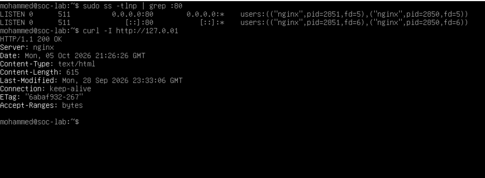
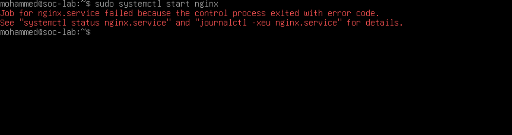
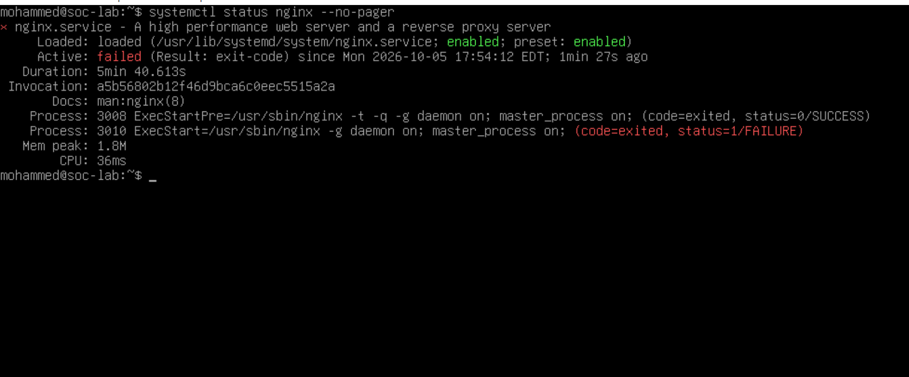
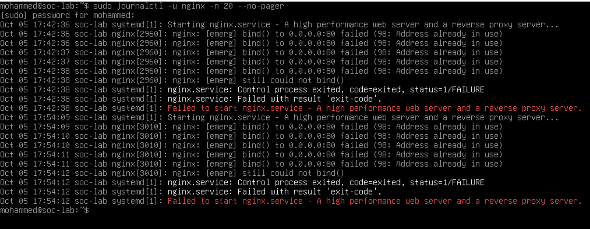
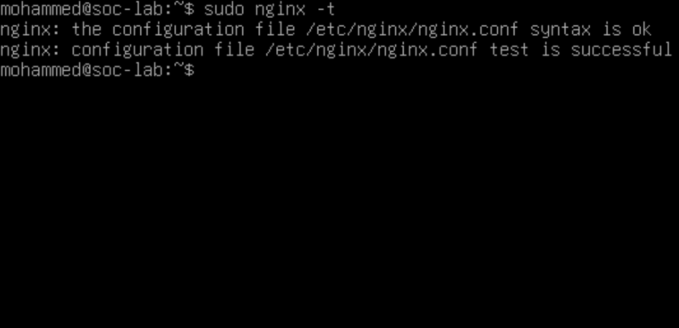
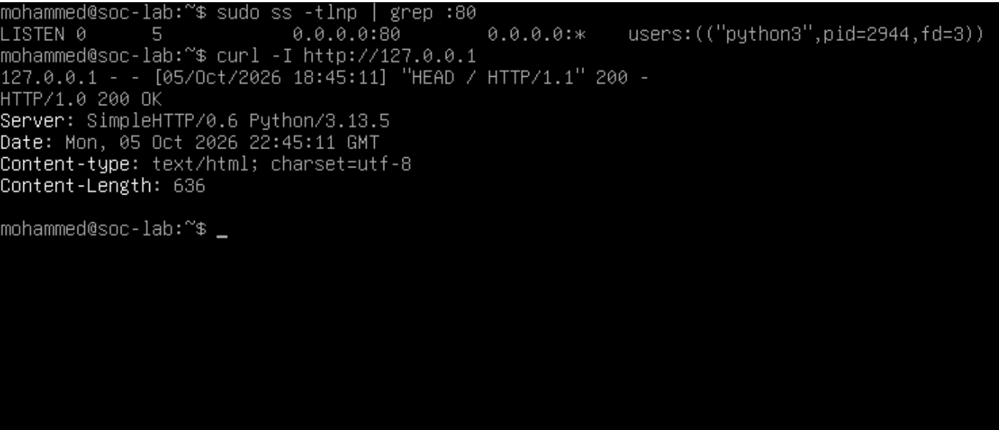
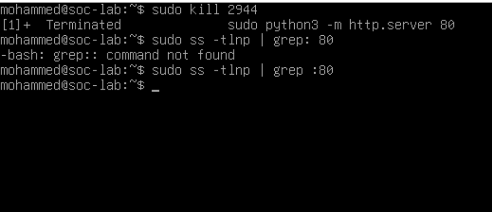
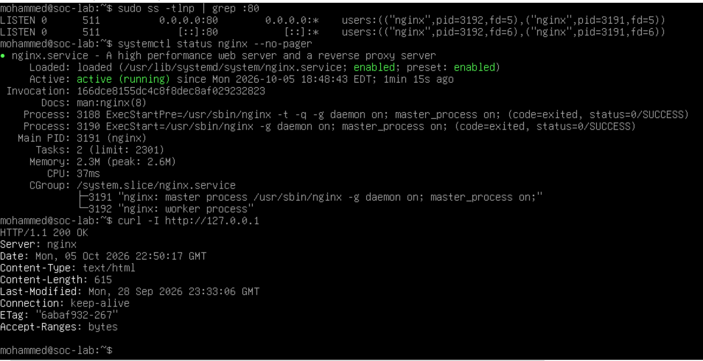

# Linux nginx Port Conflict Lab

A hands-on troubleshooting lab on a Debian VM: nginx refuses to start even though its configuration is valid, because another process already holds port 80. I diagnose the cause from logs and system tools, restore service, and document the incident.

## What this shows
- Telling a config error apart from a port conflict (`nginx -t` passes, but the service still fails)
- Reading systemd status and journal logs to find a `bind() ... Address already in use` error
- Finding which process owns a port with `ss -tlnp`
- Verifying the response actually comes from nginx (the `Server:` header), not just a 200 OK
- Writing a clear incident report: timeline, evidence, root cause, resolution, prevention

## Report
[Incident report (PDF)](incident-report.pdf)

## Environment
- Debian 13 VM (VirtualBox)
- nginx, managed by systemd
- Tools: systemctl, journalctl, nginx -t, ss, curl, kill

## Method
Baseline, introduce the fault, gather evidence, find the root cause, fix, verify, document. The fault was introduced deliberately in an isolated lab VM. This is a troubleshooting exercise, not an attack.
## Evidence

**1. Baseline: nginx owns port 80 and responds with 200 OK**

**2. nginx start fails**

**3. Service status: config test passed, start step failed**

**4. Journal: bind() to 0.0.0.0:80 failed (98: Address already in use)**

**5. nginx -t passes: the config is not the problem**

**6. Culprit found: python3 (PID 2944) owns port 80**

**7. Conflicting process stopped, port 80 free**

**8. Recovery: nginx back on port 80, 200 OK from nginx**

